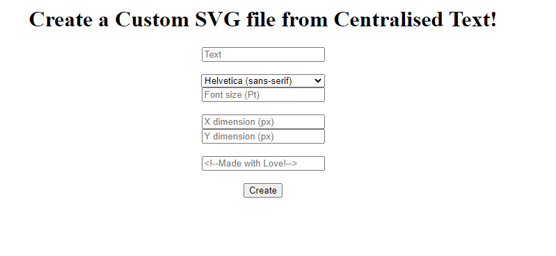
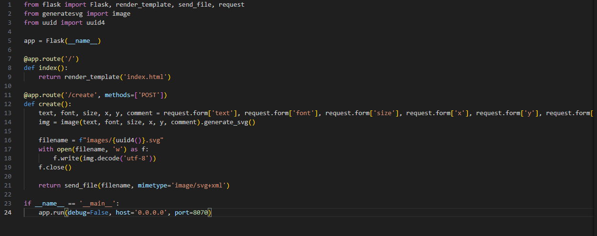
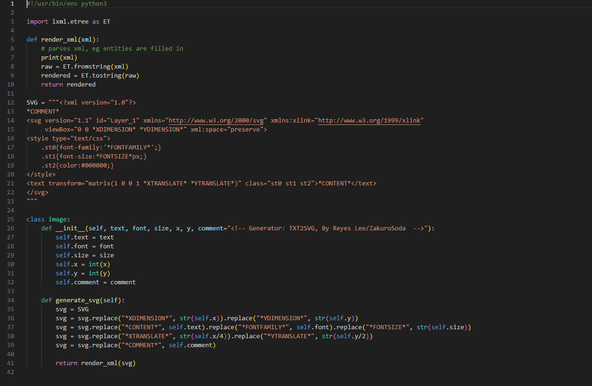
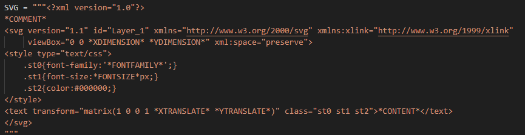
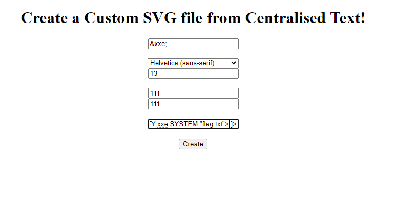
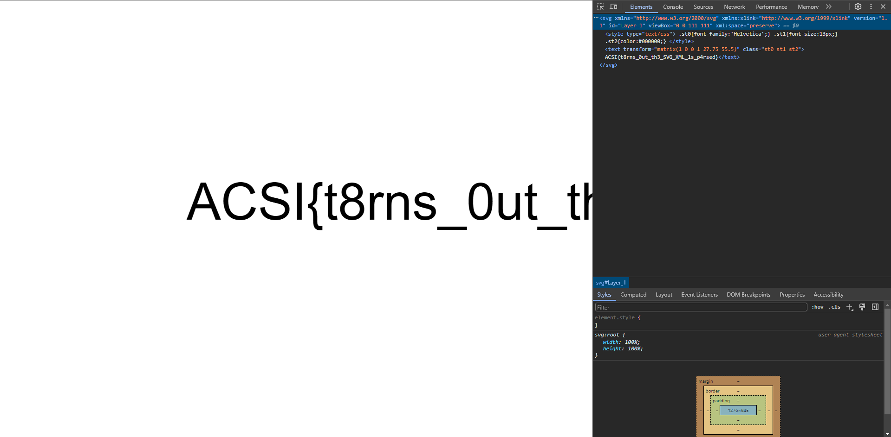

# Txt2SVG

## Challenge Info:
I made a webapp which can convert your text into a styled svg picture, but for some reason the comments that you can put in aren't in the final result. Why?

<b>No. of Solves: 15 (I'm one of them :D)</b>

## The Challenge
In this challenge, we are met with the following website:

Looking through the files provided, we find the Flask code and the code used for the SVG generator.

### Flask Code

### SVG Generator

Let us focus on this snippet of code:

We notice that the reason the comments aren't appearing in the final result because it is being executed as a comment. However this also means that we can execute whatever code we want using the comment box! But what code can we use...?

## Solution - XXE (More details on https://portswigger.net/web-security/xxe)

We can use XXE (XML External Entity injection) to perform SSRF and obtain the flag. This is our payload that we use:

### `<!DOCTYPE foo [ <!ENTITY xxe SYSTEM "flag.txt"> ]>`

What this does is create an external entity `xxe` that loads `flag.txt`, such that when the entity reference `&xxe;` is used it will replace with the contents of `flag.txt` instead.

Looking at the formatting used in the SVG generator, we find that the only place that lets us display text is in the `<text>` tag. Hence we can just insert our `&xxe;` there as input and the challenge is solved!

## Demo
### Our Input:

### Flag Output 

<b>Our final flag is `ACSI{t8rns_0ut_th3_SVG_XML_1s_p4rsed}`.</b>

