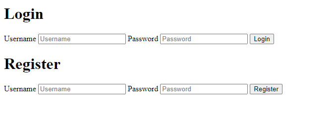
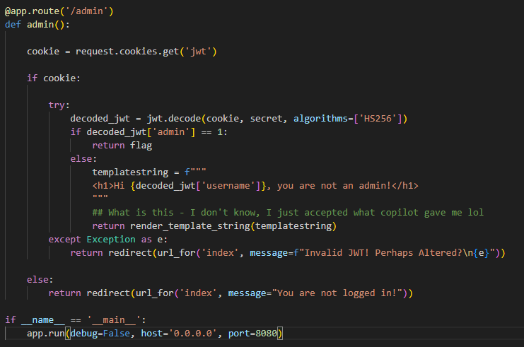
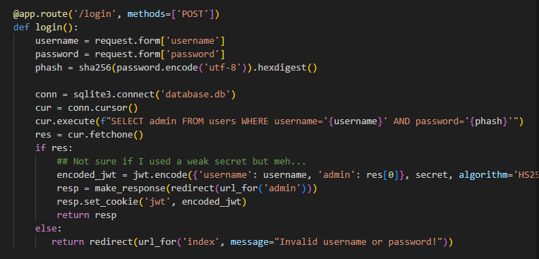
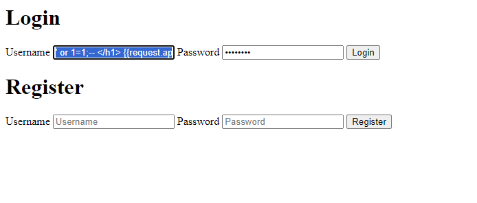
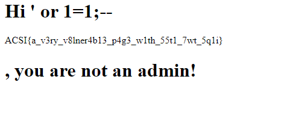

# Very Vulnerable Site

## Challenge Description

So I think this site is pretty unbreakable. The flag seems to be impossible to obtain to me, but apparently there are multiple possible ways to get the flag? Maybe I'm just dumb...

<b>No of Solves: 30</b>

## Actual Challenge

We are introduced to the following website:

As the challenge description suggests, there are multiple solutions to this problem.

<b>AS THE FULL CODE IS TOO LONG, IT WILL BE PLACED AS A FILE IN THIS DIRECTORY INSTEAD. If you would like to see the full code please refer to there instead.</b>

## Solution 1 - render_template_string Exploit
For this solution, we will focus on this section of the code:

We are interested in finding a way to exploit render_template_string. After some searching, we find this useful article: [Link](https://medium.com/@Fcmam5/ctf-as-a-developer-pt-1-template-engines-ssti-b03c59e2c095)

We find out that we can inject Python code into render_template_string. Since the value used in the templatestring is the `username` of our user, we can just inject `</h1> {{request.application.__globals__.__builtins__.__import__('os').popen('cat flag.txt').read()}} <h1>` in to return the contents of <b>flag.txt</b>.

### Where to execute?

Looking at the above code for the login, we find that the SQL used is easily exploitable to let us successfully login without knowing the contents of the database.
We submit the final input into the Login Username field: (NOTE - password can be anything)

`' or 1=1;-- </h1> {{request.application.__globals__.__builtins__.__import__('os').popen('cat flag.txt').read()}} <h1>`

### Insert the payload like this:

### Output

### <b>Our flag is `ACSI{a_v3ry_v8lner4b13_p4g3_w1th_55t1_7wt_5q1i}`</b>

## Solution 2 - JWT Exploit (WIP)

One of my friends told me you could use JWT as a solution, have yet to figure out how that works

