# Orwell's Firewall

We can divide this challenge into 2 parts, each using different exploits commonly used in Web challenges.

Also I thought the 2nd part was blind web but I realised it wasn't that bad after I found the solution lol

## Part 1 - Accessing the Real Site
Upon first entering the site, we are presented with the following in the page:

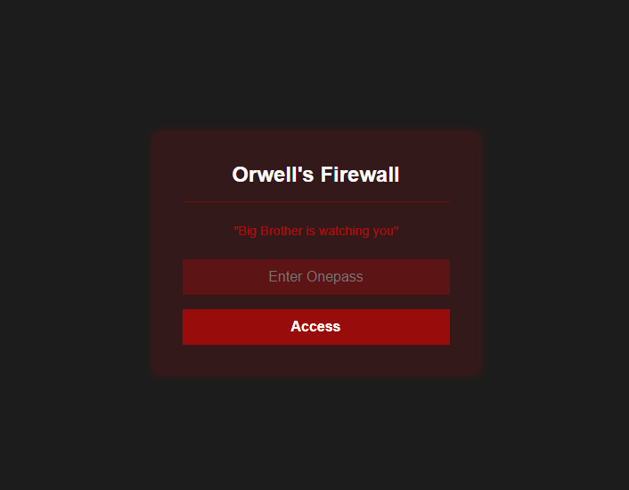

I try entering a random password, but I get the following:

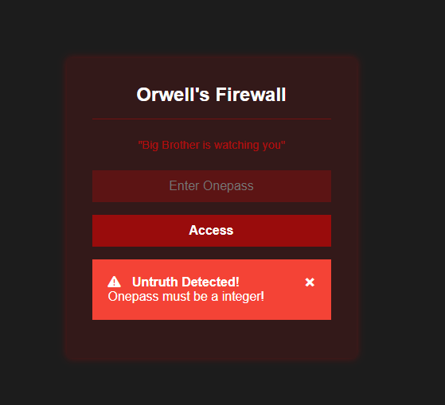

After trying some numbers to no avail, I attempt to look at the source code instead and find an interesting comment:

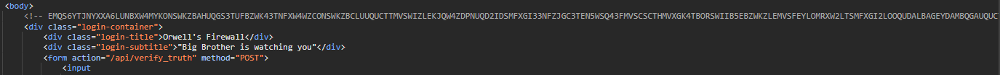

I insert this long string into Cyberchef and find out that it is Base32 encoded. Decoding reveals the following code snippet:

```
#!/bin/python3
seed = int(session["seed"])

seededRandom = random.Random(seed)
generated = seededRandom.randint(0, 100000)

session["seed"] = generated

if guess == generated:
    session["instate"] = True
    return "Correct!"
else:
    return redirect(url_for('main.index', error="Incorrect Onepass entered!"))
```
It seems as if this code takes our session seed and generates a random integer between 0 and 100000 to be our access code. I immediately notice that this is exploitable - since the output of random.randint() will be the same for a specific seed, we can just generate the access code ourselves!

But what is this session seed, you ask? As it turns out, the seed is actually contained in a cookie:
**(Note that this cookie will be different for all users. Please do not directly copy)**

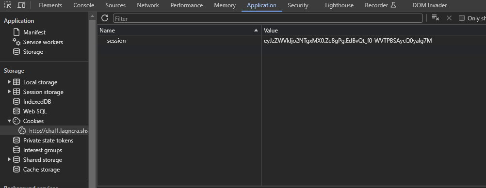

For our case, the cookie's value is `eyJzZWVkIjo2NTgxMX0.Ze8gPg.EdBvQt_f0-WVTPBSAycQ0yalg7M`.

Slapping this into https://jwt.io/, I find out that the seed is `65811`.

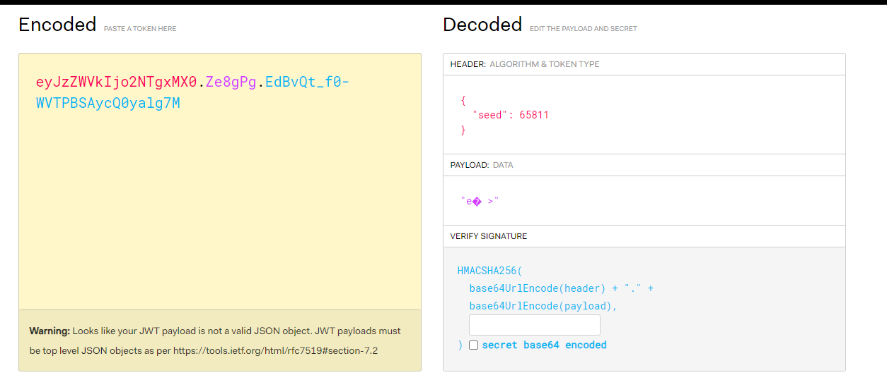

I used a simple python code to find out what our access code is:

```
import random
random.seed(65811)
print(random.randint(0, 100000))
```
`Output: 93847`

We are now in!


## Part 2 - SSTI
No flag yet?? What the heck...

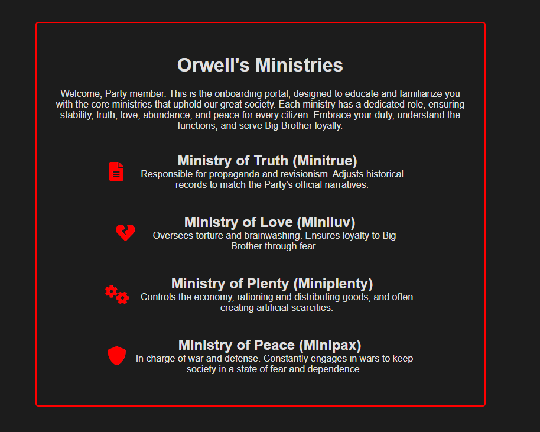


Clicking on any of the ministries directs us to a page with a short description about the ministry. \
But that's not important - what's important is the url:

`http://chal1.lagncra.sh:8100/mini?ministry=minitrue`

After some searching for an exploit, I realise that this is...
### SSTI :0000

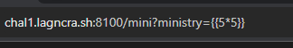

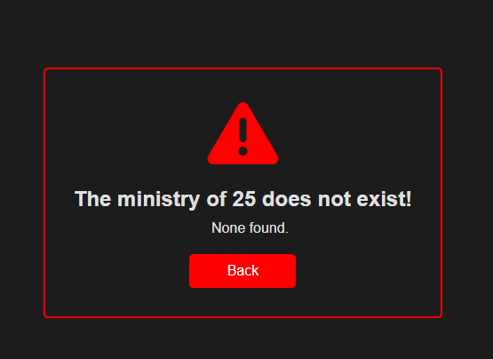

As you can see, using `{{5*5}}` as our parameter value actually compiled to produce 25. So we can use this as our starting point for the final solution.

However, some experimentation reveals that many characters, like `', ", [], +, %20 (space)` etc. are all banned! What will we ever do?


Anyway, here's a blog post that bypasses just that: https://infosecwriteups.com/ssti-bypassing-single-quotes-filter-dc0ee4e4f011

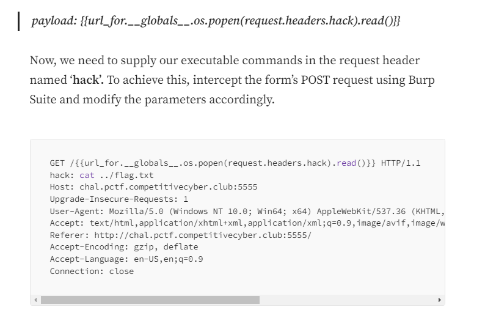

By using `request.headers`, it seems we can negate the use of any of the banned chracters by, well, just using them in the POST request instead...


As much as I hate using Burp Suite, I am now forced to use it. This is very sad :( \
So I load up Burp Suite, do everything **again**, and finally solve the challenge after modifying the `hack` parameter a bit.


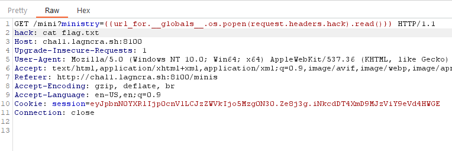

### And boom. Flag obtained. 
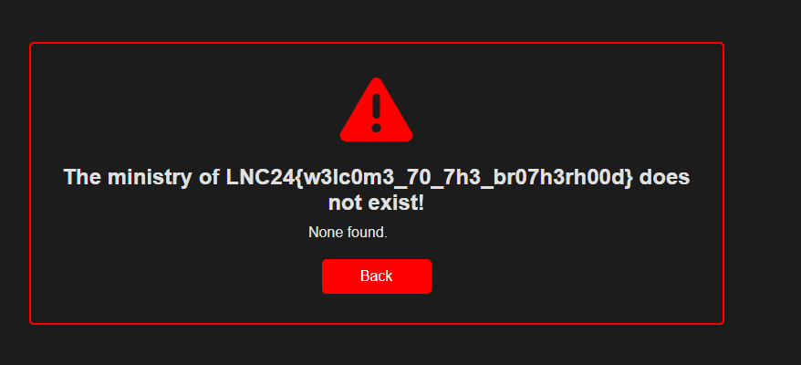

### The flag is: `LNC24{w3lc0m3_70_7h3_br07h3rh00d}`


