# Post It

We are presented with the following site with a login page:

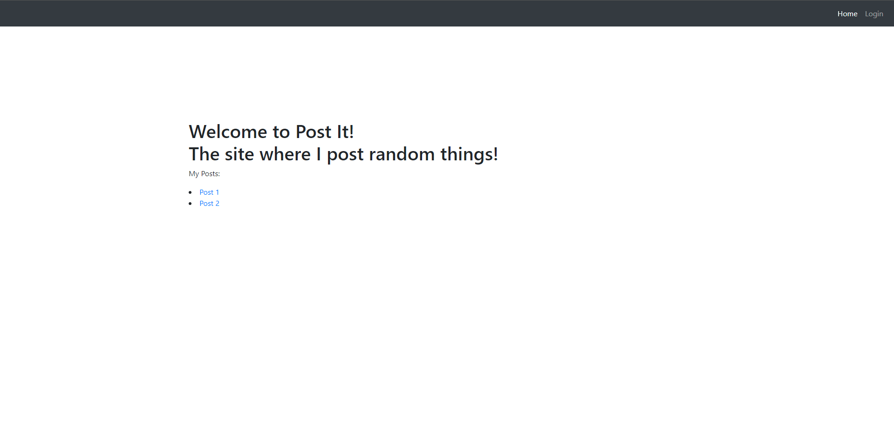

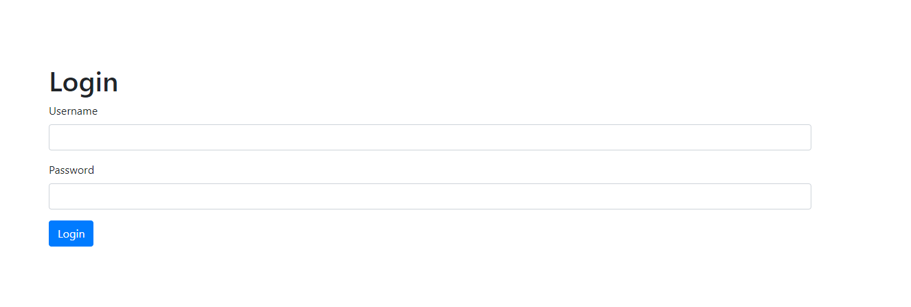


## Signing In - (just read files...)

Looking at the files we are provided, we notice the following code in `app/app.py`:

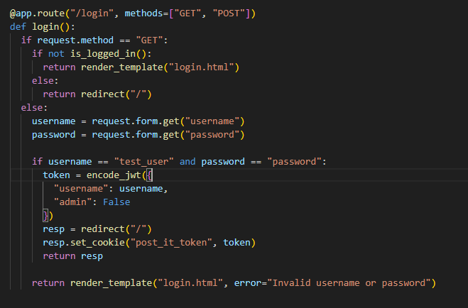

So we just need to use `username: test_user` and `password: password`. Pretty easy so far!


## Gaining Admin Status - (JWT with RSA key)

Looking at the 2nd post, we find the following text:

```
Some of you for some reason want to validate your JWT token with the RSA public key.

I have now updated the website so that you can get the public key from the website when you log in. Just click on the "RSA Key" link in the navbar.
```

So we have to do something with the JWT token in our cookies. After finding the cookie, I put it into https://dinochiesa.github.io/jwt/ to modify it.

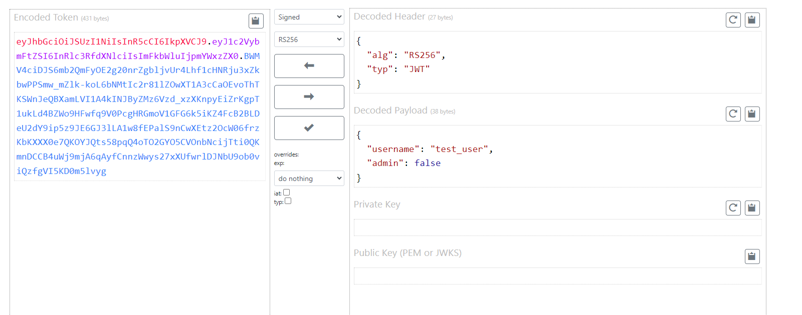

It seems like the JWT token uses RS256 for its signature.\
We can find the public and private keys in our files provided under the `app/keys` folder.

Using both keys to verify the signature, we can then change the `"admin": false` parameter to `"admin": true` and edit the cookie on the website. 

We have now gained admin access!

I find one new post that says:
```
Developing your very own website is such a pain to debug,

but Flask's debug mode makes it so much easier!
```

What does debug mode do and how are we meant to exploit this...?

After some searching, this is the best writeup I could find: https://book.hacktricks.xyz/network-services-pentesting/pentesting-web/werkzeug

As it turns out, Flask debug mode gives you access to an interactive console where you can execute code at `/console`. However, it seems like we need a PIN code! Luckily the writeup above also explains how to decode that...


## Accessing Console

This was the most painful part of this challenge and is why I didn't manage to solve it despite knowing what I was supposed to do lol (also I just can't read in general and realised the writeup actually had way more detailed instructions later)


For convenience, I have attached a snippet from the writeup here:

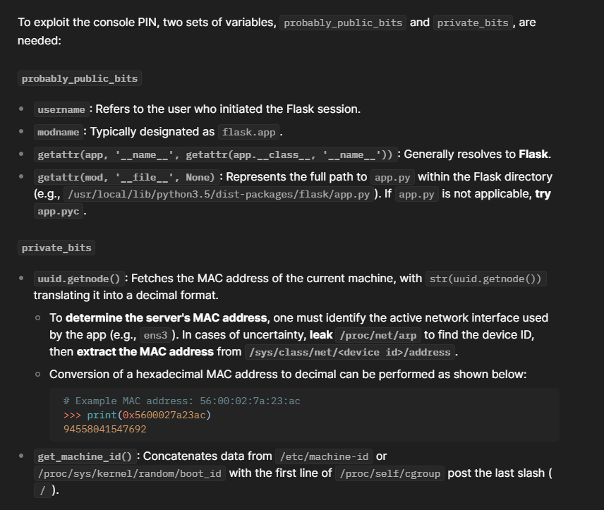

From this, we can see that we need to access multiple directories that haven't been made available to us. So how can we solve this?

Looking back at `app.py`, we find this code:

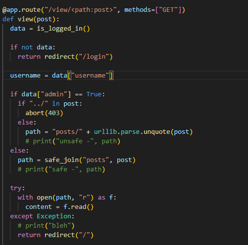

Which means we can use path traversal attacks to read the files that we need! But using `../` is banned... how can we bypass this?

Read: https://security.stackexchange.com/questions/96736/path-traversal-filter-bypass-techniques

Using `%2e%2e/` or any other variants that use `%2e%2e` get processed immediately, causing it to apply on `/view` and cancelling it out. (I think that's how it works? Not too sure)\
And using `..%2f` gets detected by the checker and blocks us.

Turns out the solution is to use double URL encoding! By using `..%252f`, we are able to perform our path traversal. **(I spent so long failing to figure this out it is actually stupid lol this is why I couldn't solve the chal)**

### <u>Results of our path traversal:</u>
<u>**From /proc/net/arp**:</u>\
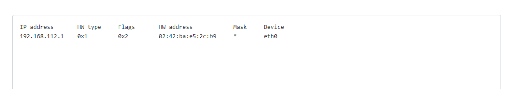

We find that the network interface (device id) is `eth0`.

<u>**From /sys/class/net/eth0/address:**</u>\
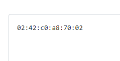

To get our MAC address, we decode the hex `0x0242c0a87002` into decimal to get `2485723361282`.

<u>**From proc/sys/kernel/random/boot_id:**</u>\
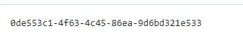

<u>**From proc/sys/kernel/random/boot_id:**</u>\
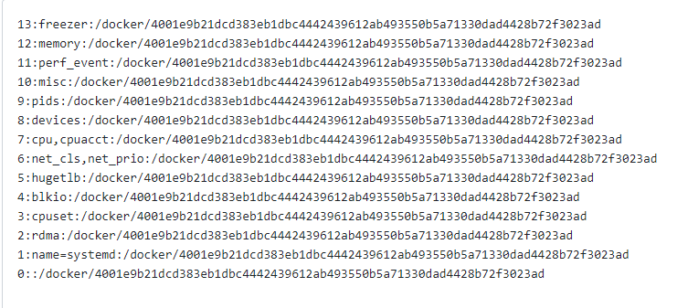

Hence the machine ID is `0de553c1-4f63-4c45-86ea-9d6bd321e5334001e9b21dcd383eb1dbc4442439612ab493550b5a71330dad4428b72f3023ad`.


### <u>Decoding the console PIN</u>

Finally, we have:
```
pub = [
  'app',
  'flask.app',
  'Flask',
  '/usr/local/lib/python3.11/site-packages/flask/app.py' #I still have no idea how to get this... I can understand python3.11 can be found from the Dockerfile but idk why its site-packages and not dist-packages like in the writeup I found :/
]

priv = [
  '2485723361282',
  '0de553c1-4f63-4c45-86ea-9d6bd321e5334001e9b21dcd383eb1dbc4442439612ab493550b5a71330dad4428b72f3023ad'
]
```
By using the solve script **(I've added it under `solve.py` here)**,

We find that our PIN is `681-688-945`. I try this on the console and it is indeed correct! What can we do with the console though?

Referring to this other writeup (https://ctftime.org/writeup/36100), we can run the code `__import__('os').popen('cat ../../flag.txt').read();`.
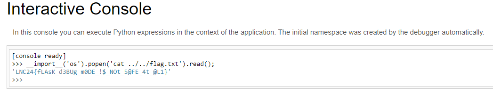

With that, we have finally solved the challenge!

### The flag is: `LNC24{fLAsK_d3BUg_m0DE_!$_NOt_5@FE_4t_@L1}`


## My Final Thoughts:

Honestly this was a really good Web chal and I learned a lot from it but I absolutely suffered with being stuck at the last part for 90% of the CTF duration... 10/10 would suffer again 

Solved after CTF ended after I got told about `%252f` :D\
I swear I definitely tried it at some point though... how did I not notice it worked lmao
