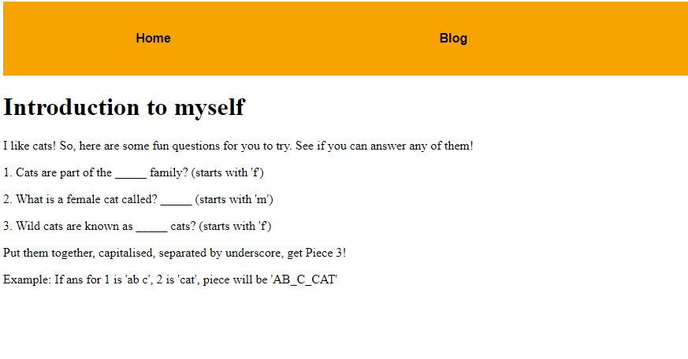
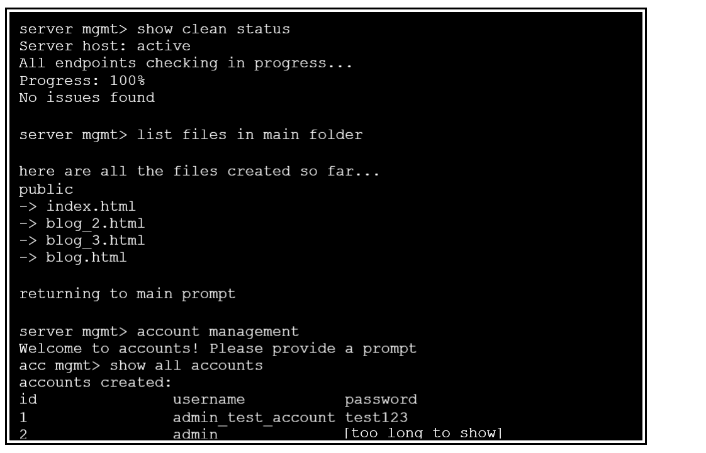
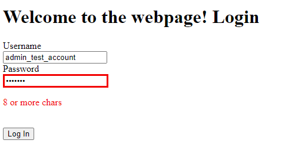
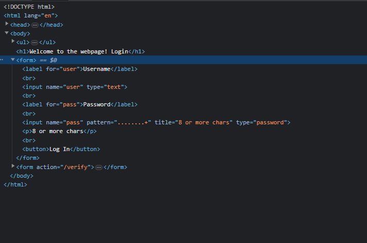
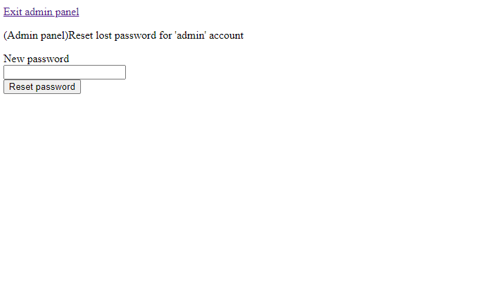
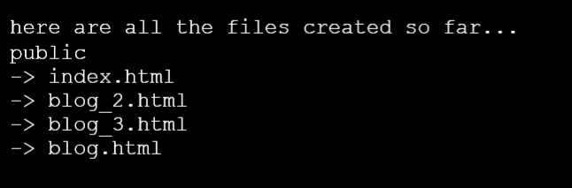
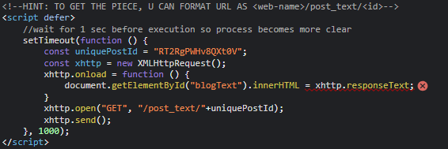
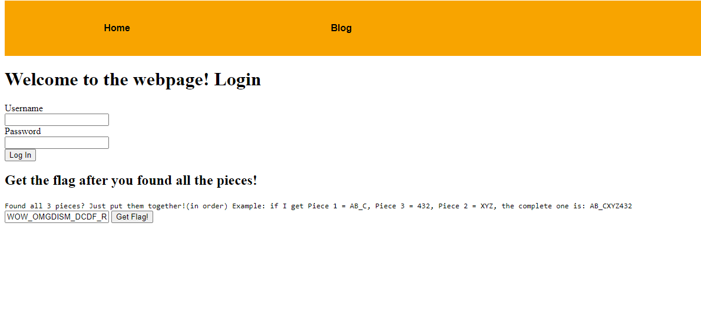
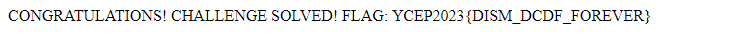

# WOSINT my beloved


For this challenge, we need to find 3 different pieces hidden in different places.

The following pieces are ordered by difficulty (in my opinion)

<br/><br/>

## 1. Piece 3
Navigating to the Introduction blog page, we find the following: 
<br/>



After a few google searches, we find out that Piece 3 is: ```FELIDAE_MOLLY_FERAL```

<br/><br/>

## 2. Piece 1
The next step is to go to the Welcome blog page. We find an image of a "fake" terminal:
<br/>



Notice that there are 2 accounts:```admin_test_account``` and ```admin```.

Since we don't have the password for ```admin```, we can try using the login credentials for ```admin_test_account``` back in the Home page first.

<b>However, we are met with an error:</b>
<br/>



A quick look into the source code reveals that the input box for password seems to have some RegEx preventing us from using the password ```test123``` as it is only 7 characters long.
<br/>



Luckily for us, we can edit the HTML to remove the pattern parameter in &lt;input&gt;, allowing us to login.

We can now reset the password for ```admin``` to anything we like.
<br/>



Using our new login credentials for ```admin``` to sign in, we obtain Piece 1: ```WOW_OMG```

<br/><br/>

## 3. Piece 2
Remember the fake terminal from earlier? It also displays a list of files in the website!
<br/>



<b>There's blog.html, blog_2.html, blog_3.html... what if there's a blog_1.html?</b>

Sure enough, there is a blog_1.html that we can access using [http://chal.gryphons.sg:4007/blog_1](http://chal.gryphons.sg:4007/blog_1).

At first, there seems to be nothing, but if we look into the source code we find the following code:
<br/>



Following the hint, we enter in [http://chal.gryphons.sg:4007/post_text/RT2RgPWHv8QXt0V](http://chal.gryphons.sg:4007/post_text/RT2RgPWHv8QXt0V) as our new link.

Piece 2 obtained! ```DISM_DCDF_ROCKS```

P.S. note that post_text is not surrounded by &lt;&gt;. It's not a variable!

<br/><br/>

## 4. Putting it together
Combining the 3 pieces, we get: ```WOW_OMGDISM_DCDF_ROCKSFELIDAE_MOLLY_FERAL```

We insert the flag into the form as shown below:
<br/>




### This reveals the flag that we have been looking for: ```YCEP2023{DISM_DCDF_FOREVER}```

Unfortunately you won't be able to obtain those 1500 points now that YCEP is over... better luck next time!
<br/>


